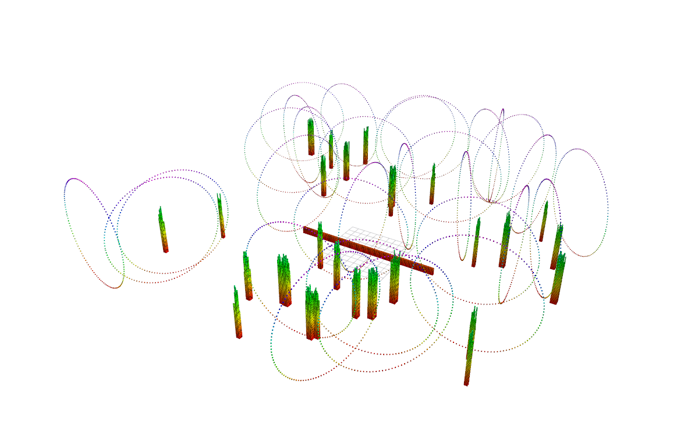
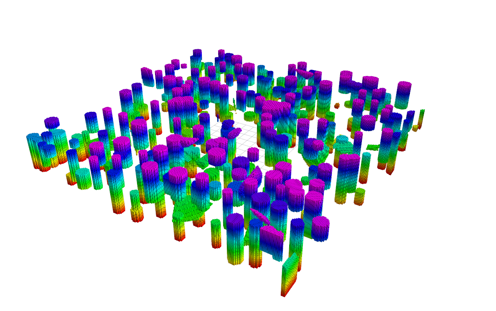
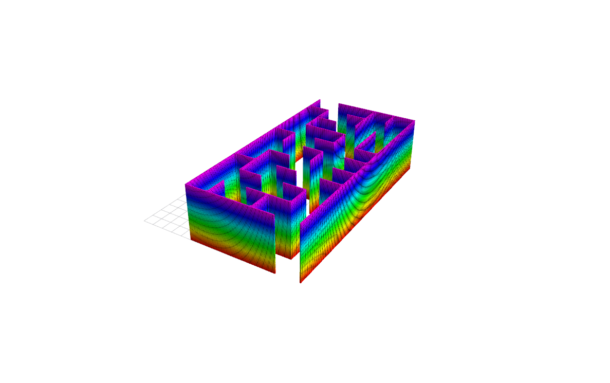
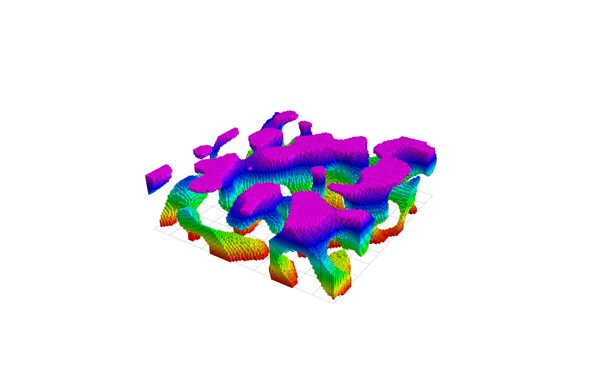

# ROS2 Map Generator

| Random forest | Grid map | Structured map | Perlin |
| --- | --- | --- | --- |
|  |  |  | 

## Build

From your ROS2 workspace root:

```
colcon build --packages-select map_generator
source install/setup.bash
```

## Run

```bash
# Random forest
ros2 launch map_generator random_forest.launch.py map_x_size:=60.0 map_obs_num:=50 map_resolution:=0.2
# PCD publish
ros2 launch map_generator map_pub.launch.py pcd_file:=/path/to/map.pcd add_boundary:=1 downsample_res:=0.2
# Structured map
ros2 launch map_generator structure_map.launch.py map_x_size:=30 map_y_size:=30 map_x_origin:=-15 map_y_origin:=-15 params_cylinder_ratio:=0.1
# Grid/map reader
ros2 launch map_generator read_grid_map.launch.py map_mode:=1 folder_path:=./data/img/maze use_folder:=true
# Mockamap
ros2 launch map_generator mockamap.launch.py type:=1 resolution:=0.1 x_length:=10 y_length:=10 z_length:=3
```

## Acknowlegement
This repository builds upon the following projects. I appreciate the excellent work of the original contributors.
- [kr_param_map](https://github.com/KumarRobotics/kr_param_map)
- [mockamap](https://github.com/HKUST-Aerial-Robotics/mockamap)
- [Fast-Planner](https://github.com/HKUST-Aerial-Robotics/Fast-Planner)